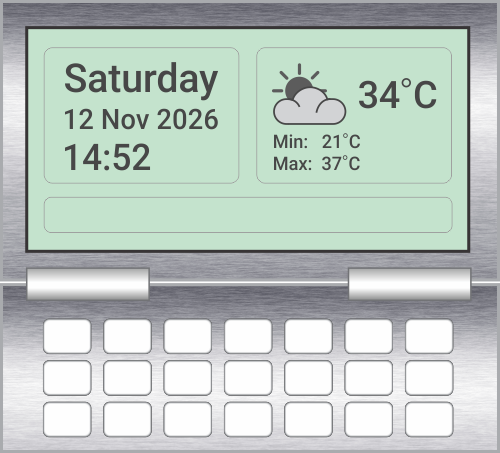
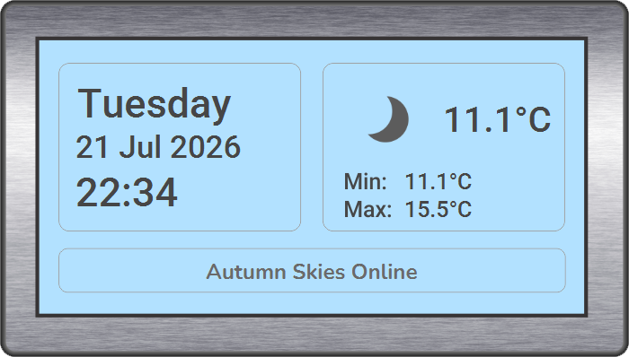

# 🖥️ Personal Desktop Console – JavaFX

*A fixed-layout JavaFX console inspired by a digital instrument display*

---

## 📌 Project Overview

This project is a **custom-designed personal desktop console**, built as a standalone JavaFX application.

It is intentionally **not a conventional dashboard**, but a structured, fixed-layout **digital instrument** inspired by physical weather consoles and LCD displays.

Version 1 provides a live date, time, and weather display within a purpose-built desktop interface.

Key goals:

* Apply object-oriented structure to a UI-driven Java application
* Separate display logic, weather services, and data storage
* Integrate live data from an external API
* Build a stable, fixed-layout interface with no reflow or movable widgets
* Create a visually distinctive, device-inspired desktop application
* Establish a foundation for future expansion through reminders and database integration

---

## 🖼️ Screenshots



Original Console Layout Concept
<br><br><br>


Completed Version 1 Console  
*The lower expansion section was removed from Version 1 and preserved separately for future development.*

---

## ✨ Current Features

### 🕒 Live Date and Time Display

* Displays the current day, date, and time
* Uses the computer's local system clock
* Formats the time in a 24-hour format
* Automatically refreshes every minute using a JavaFX `Timeline`

### 🌤️ Live Weather Display

* Retrieves live weather data from WeatherAPI
* Displays:
  * Current temperature
  * Minimum temperature
  * Maximum temperature
  * Current weather icon
* Weather information loads when the application starts
* Weather information automatically refreshes every minute

### 🌦️ Weather Condition Mapping

* Uses WeatherAPI condition codes rather than condition text
* Maps the available weather conditions to custom-designed icons
* Supports:
  * Clear conditions
  * Partly cloudy conditions
  * Overcast conditions
  * Mist and fog
  * Rain and showers
  * Thunderstorms
  * Snow, sleet, and ice
* Uses WeatherAPI's `is_day` value to display separate day and night icons for:
  * Clear conditions
  * Partly cloudy conditions
* Falls back to a default icon when an unexpected condition code is received

### 🖥️ Custom Desktop Window

* Transparent JavaFX stage and scene
* Transparent root container
* Borderless, device-style application window
* Custom close button
* Invisible drag zone allowing the application to be repositioned on the screen
* Fixed-size, non-resizable interface

### 🔤 Bundled Application Font

* Uses a custom Nunito Bold font bundled inside the application resources
* The font is loaded before the FXML interface is created
* The application does not require the font to be installed on the operating system

### 📦 Windows Packaging

* Runnable JAR created through IntelliJ IDEA
* Windows installer created using `jpackage`
* Desktop shortcut and Start Menu entry supported
* Java and JavaFX runtime packaged with the installed application

---

## 🧱 Application Structure

The application separates the interface, logic, API service, and weather data into dedicated classes.

### `Main`

* Loads the bundled application font
* Loads the FXML interface
* Creates the transparent JavaFX stage and scene

### `ConsoleView`

* Controls the JavaFX interface
* Updates the date and time display
* Requests live weather data
* Updates the temperature values and weather icon
* Handles the custom close button and draggable window

### `ConsoleLogic`

* Formats the current day, date, and time
* Maps WeatherAPI condition codes to the correct weather icon
* Handles clear and partly cloudy day/night icon selection

### `WeatherService`

* Connects to WeatherAPI
* Sends the HTTP request
* Parses the returned JSON data using Jackson
* Extracts temperature, condition code, and day/night information

### `WeatherData`

* Stores the weather values returned by the service
* Provides the shared weather data used by the temperature and icon displays

---

## 🎨 Visual Design

* Inspired by **digital console instruments and LCD displays**
* Restrained **monotone and duotone aesthetic**
* Fixed layout with clearly defined information territories
* Custom background, weather icons, and interface elements
* Original visual assets created in CorelDRAW and Photoshop
* No floating cards
* No rearrangeable widgets
* No scrolling content
* No responsive web-style layout

The interface is designed to behave more like a dedicated electronic instrument than a conventional desktop dashboard.

---

## 🖌️ Tools and Design Process

* Interface concept and assets designed in **CorelDRAW**
* Image editing and transparent assets prepared in **Adobe Photoshop**
* Layout recreated in **Gluon Scene Builder**
* Application developed in **IntelliJ IDEA**
* Source code managed through **Git and GitHub**

---

## 💻 Development Environment

* **Language:** Java
* **JDK:** Java 21.0.7
* **Framework:** JavaFX 21
* **JSON Processing:** Jackson
* **Weather Data:** WeatherAPI
* **IDE:** IntelliJ IDEA Community Edition
* **UI Builder:** Gluon Scene Builder
* **Design Tools:** CorelDRAW and Adobe Photoshop
* **Version Control:** Git and GitHub
* **Packaging:** IntelliJ Artifacts and `jpackage`

---

## 🚀 How to Run the Source Code

1. Clone the repository:

   ```text
   git clone https://github.com/aso-repos/DesktopConsole_JavaFX.git
